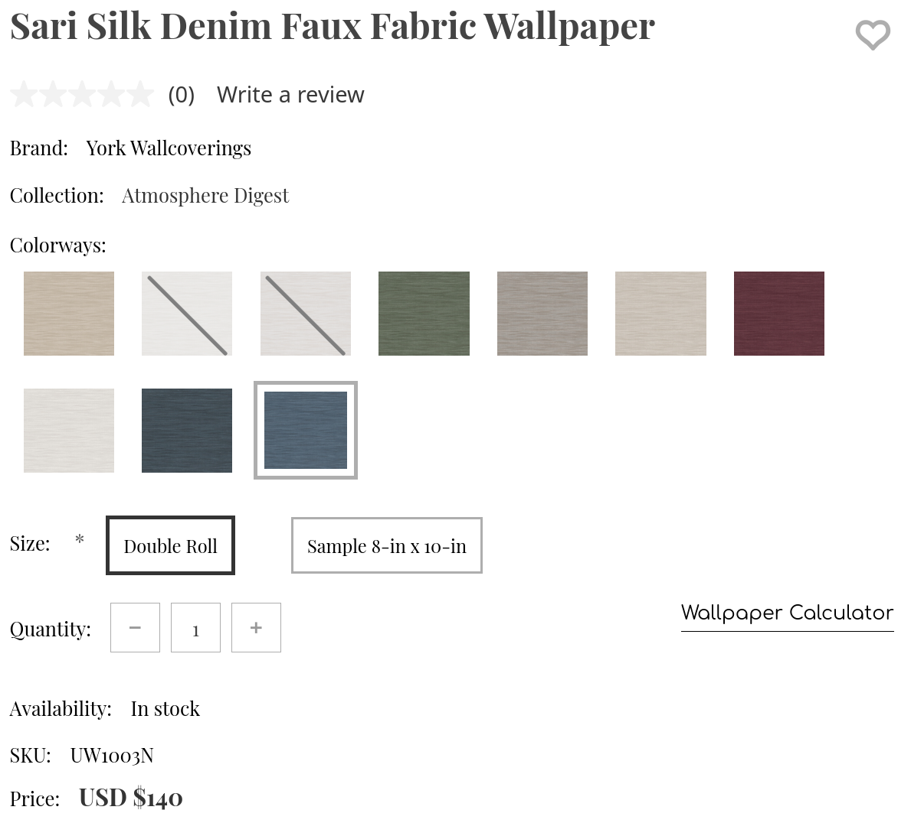
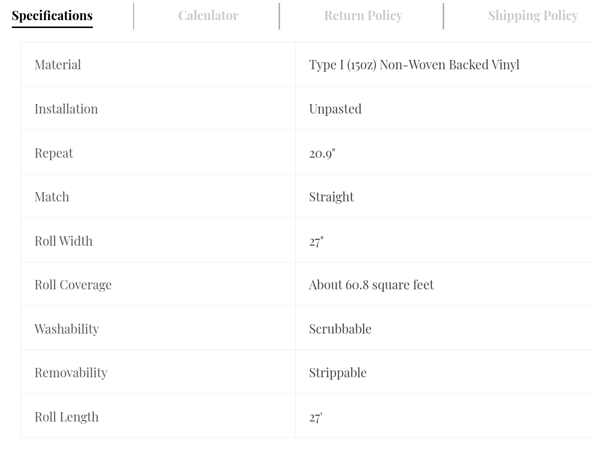
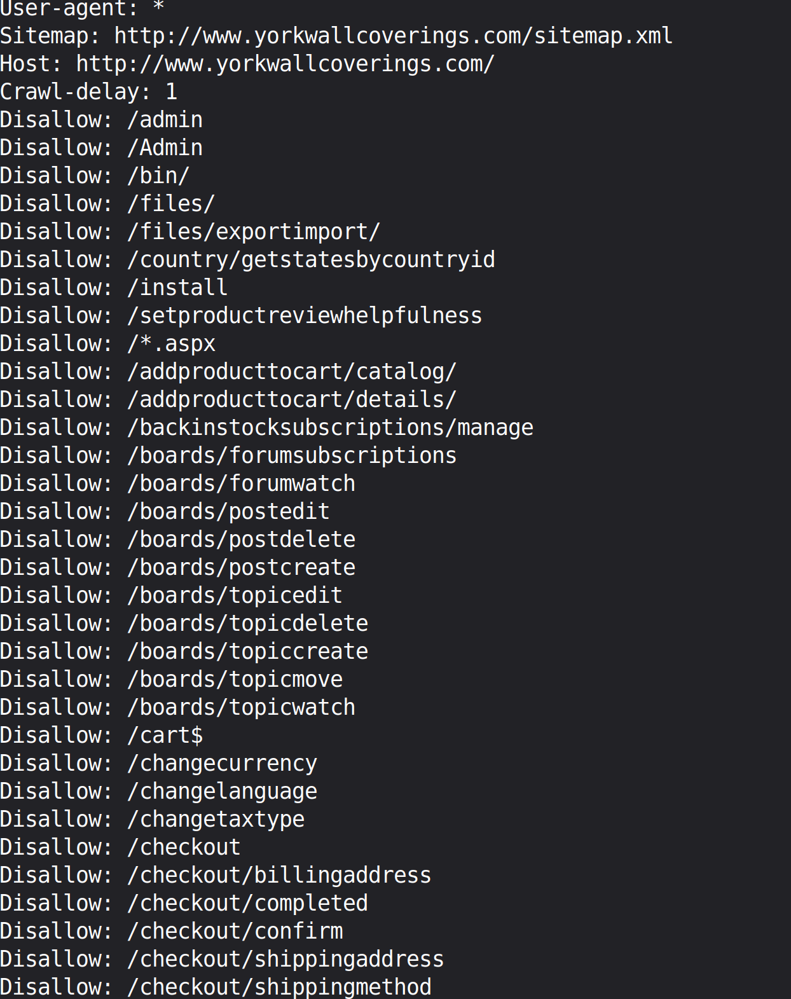
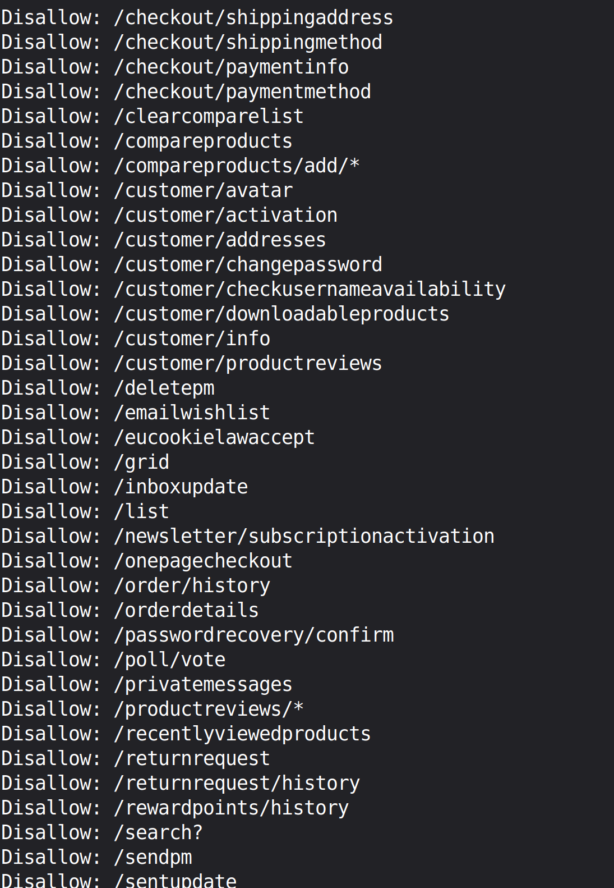
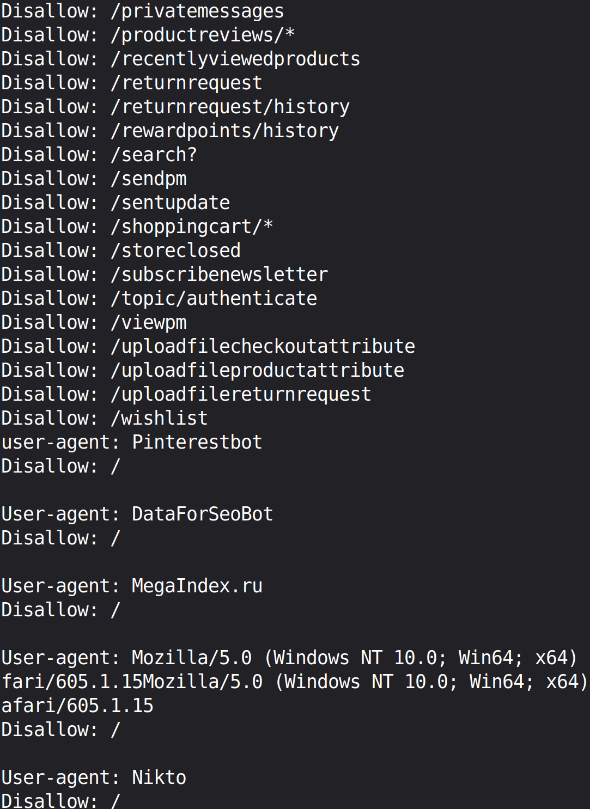

# Wallpaper Catalog Ingest

This project is created with the sole purpose of extracting data from an e-commerce website.

This extracted data then gets saved into a .csv file.

Website link: [Click Here](https://www.yorkwallcoverings.com/wallpaper-york)

### Target Data:

This data is what we are extracting from the website including:

  1. SKU

  2. Product Name

  3. Brand 

  4. Collection

  5. Sizes

  6. Availability

  7. Price

  8. Material

  9. Installation

  10. Repeat

  11. Match

  12. Roll Width

  13. Roll Coverage

  14. Washability

  15. Removability

  16. Roll Length

  17. Image link

 

You can check how the data looks like on the website by clicking below:

  
<b>Click here for Target Data</b>

   
  
  

### Demo

<video src="https://github.com/user-attachments/assets/d3168cf3-abd6-490e-bb62-4a637218d194" width="600px" controls></video>

You can check the sample of spreadsheet created during the recording of this video right here:

[Preview File](https://www.dropbox.com/scl/fi/3raqxla11ze8ajrb3j2dm/Wallpaper_listings.csv?rlkey=0o4q61togtrfjdew8nxwre0p7&st=b1c1h2az&dl=0) | [Download](https://www.dropbox.com/scl/fi/3raqxla11ze8ajrb3j2dm/Wallpaper_listings.csv?rlkey=0o4q61togtrfjdew8nxwre0p7&st=b1c1h2az&dl=1) 

### How does it work?

This project is a 2 stage data extraction pipeline which:

1. It grabs the product links from - all wallpapers page

2. Then it visits the product page one by one, extracting data in the process.

### Benefits of creating a pipeline

If you don't want to waste hours manually typing thousands of product details into a spreadsheet, this tool is the perfect solution.

If you wanted the updated data from the website, this project can do this in one click! However, it will take some time.

This is a data pipeline which is connected to the e-commerce site, which means this script isn't just limited for creating .csv file. You can change the direction of the pipe to create whatever kind of file u want - database file, Excel file, Word file, PDF's etc. The only catch is: It has to be a file which can take the data and handle it!

### Safety Guidelines

This script is only taking public data and isn't breaking any rules! The creation of this script is strictly following all the rules and regulations of the website given at robots.txt

I am interested in the art of web scraping and only doing this for learning purposes! 

 

> **Robots.txt were last checked on date: 15 May, 2026**

> **If anyone has any problems regarding this repo, please feel free to contact me!**

 

Screenshots from website.com/robots.txt page are given below:

  
<b>Click Here to View robots.txt Screenshots</b>

   
  
  
  

### Highlights

**Bypassed Javascript Dynamic URL formation:** The site was using an api endpoint for getting relevant sku number. This sku number was the key for forming product URLs and the logic was written in javascipt for dynamic URL formation. I use BeautifulSoup which can't execute javascript so forming link to the products wasn't as easy as - this tag has the product URL.

**This Project is Extracting:**
  
  * 16 datapoints per product
  * 24 products per page
  * 82 pages in total(can change in future)

### Tech Stack

* httpx: I replaced requests with httpx because of async execution capabilities, TLS fingerprinting support and syntax is pretty much the same as requests library.

* BeautifulSoup4 (with lxml parser): beautifulSoup4 is what I use for data extraction and lxml is faster than the default html.parser.

* time library: time library is most commonly used for rate limiting so that the script accidently doesn't send too many requests.

* pandas library: pandas is what is used for loading the data into the .csv file when the data extraction is complete and it loads data into .csv file for every page of extraction completed by the script.

* loguru library: for recording logs in a seperate file. If a script ever started not working, I will know exactly what caused the crash!
